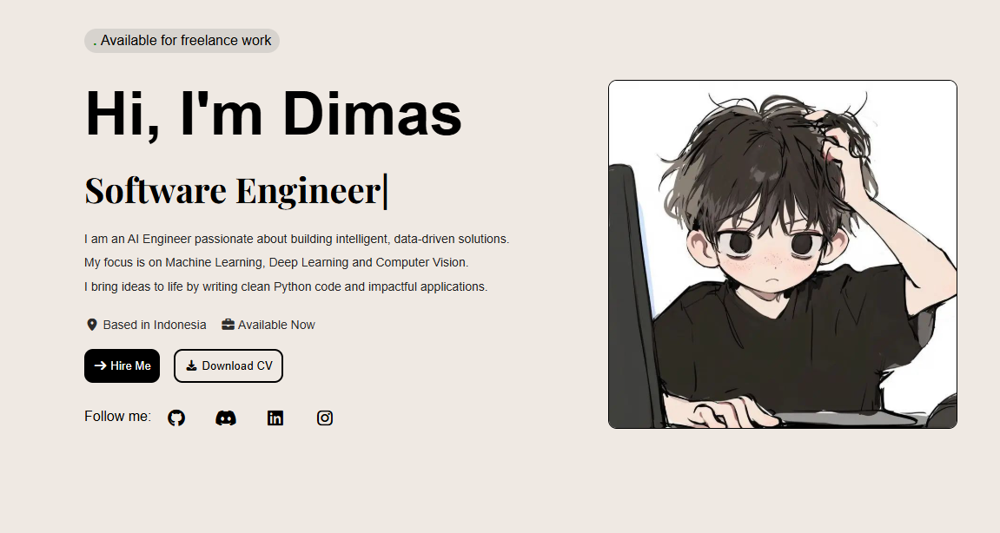

# Dimas Tri M Portfolio Showcase 💻

I am an AI Engineer passionate about building intelligent, data-driven solutions.
My focus is on Machine Learning, Deep Learning and Computer Vision.
I bring ideas to life by writing clean Python code and impactful applications.

---

## Live Demo 🚀

You can view the live website here: [Live Demo](https://stalwart-baklava-8ed433.netlify.app/)

---

## 🌟 Website Sections

- **Home**: Developer introduction with avatar and short description
- **About**: Experience, tech stack, personal insights, and skill cards
- **Projects**: Showcase of projects with images, descriptions, and skills
- **Services**: Highlighting services offered with interactive cards
- **Contact**: Contact form and social links with interactive hover effects
- **Footer**: Quick navigation links and social media links

---

## ⚡ Features

- Dark theme with **blue accent color** for highlights
- Smooth scroll navigation between sections
- Fully **responsive design** for desktop, tablet, and mobile
- Hover effects and animations for buttons, cards, and links
- Contact form with validation
- Interactive social links

---

## 🛠 Technologies Used

- **HTML5** – Structure and semantic content
- **CSS3** – Styling, responsive layouts, Flexbox & Grid
- **JavaScript (Vanilla JS)** – Interactivity and animations
- **Font Awesome / Boxicons** – Icons
- **AOS.js** – Scroll animations

---

## License

This project is licensed under the terms described in the [LICENSE](LICENSE) file.

---

---

## 📬 Contact

- Email: dimsartz021@gmail.com
- Location: Central Java, Indonesia
- LinkedIn: [LinkedIn](https://www.linkedin.com/in/mohamed-amine-hamzaoui-a2453a35b/)
- GitHub: [GitHub](https://github.com/DimasTriM)
- Instagram: [Instagram](https://www.instagram.com/dimasu_tm?igsh=MXF2dWNubTF4N205Mw==)

---

Made with ❤️ by **Amine Hamzaou**

```bash
git clone https://github.com/Saboo24/portfolio-showcase.git
```
